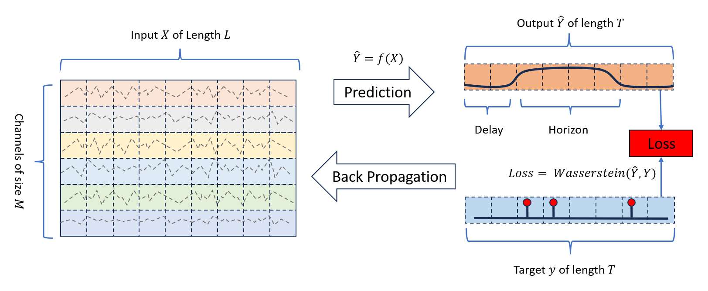
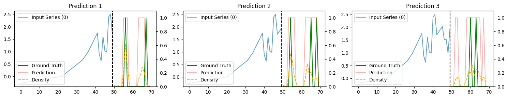
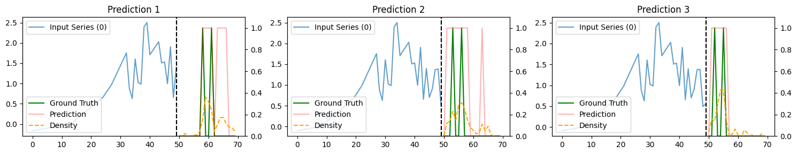
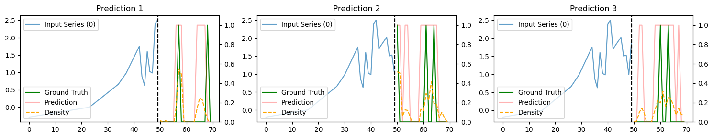
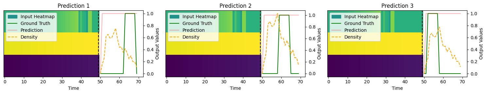
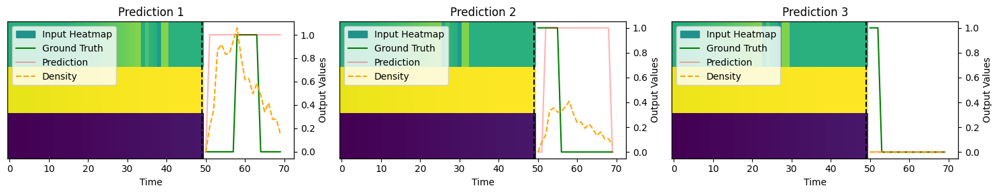
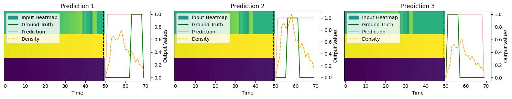

# Anomaly Prediction: A Novel Approach with Explicit Delay and Horizon
This is the official repository for the paper "Anomaly Prediction: A Novel Approach with Explicit Delay and Horizon" 

[🇨🇳 简体中文](./readme_zh.md) | [🇬🇧 English](./readme.md) | [🇫🇷 Français](./readme_fr.md) | [🇩🇪 Deutsch](./readme_de.md) | [🇷🇴 Română](./readme_ro.md)


Link to paper : https://arxiv.org/abs/2408.04377

## Abstract
Anomaly detection in time series data is a critical challenge across various domains. Traditional methods typically focus on identifying anomalies in immediate subsequent steps, often underestimating the significance of temporal dynamics such as delay time and horizons of anomalies, which generally require extensive post-analysis. This repository introduces a novel approach for time series anomaly prediction, incorporating temporal information directly into the prediction results. We propose a new dataset specifically designed to evaluate this approach and conduct comprehensive experiments using several state-of-the-art methods. Our results demonstrate the efficacy of our approach in providing timely and accurate anomaly predictions, setting a new benchmark for future research in this field.

## Anomaly Prediction with Explicit Delay and Horizon 

*Figure 1: Illustration of Anomaly Prediction Task.*

## Comparison of Anomaly Prediction Anomaly Detection

*Figure 2: Comparison of Anomaly Prediction Anomaly Detection.*

## Usage
To use this repository, follow these steps:

1. Clone the repository:
   ```bash
   git clone https://github.com/JiangYou2025/AnomalyPrediction.git


2. Open the Anomaly_Prediction_Examples.ipynb:
   ```bash
   run all

To use the anomaly_prediction library, follow these steps:
1. Open the anaconda, enter the environment "base":
   ```bash
   pip install anomaly-prediction

2. Open the python editor:
   ```bash
   python

3. Import the anomaly_prediction library:
   ```bash
   from anomaly_prediction import *
   print(anomaly_prediction.__version__)

## Examples

#### Example of Anomaly Prediction on Synthetical Dataset 1 with Fully Connected Network (FCN)



*Figure 3: Example 1-9 of Anomaly Prediction on Synthetical_1.*

#### Example of Anomaly Prediction on Synthetical Dataset 10 with Fully Connected Network (FCN)



*Figure 4: Example 1-9 of Anomaly Prediction on Synthetical_10.*


## Citation
When using this paper or code, please use:
   ```tex
   @inproceedings{you_2024_anomaly_prediction,
   author={You, Jiang and Cela, Arben and Natowicz, René and Ouanounou, Jacob and Siarry, Patrick},
   booktitle={2024 IEEE 20th International Conference on Intelligent Computer Communication and Processing (ICCP)}, 
   title={Anomaly Prediction: A Novel Approach with Explicit Delay and Horizon},
   year={2024},
   volume={},
   number={},
   pages={-},
   keywords={Time series;Anomaly Prediction;Anomaly Detection;U-Net;Transformers;},
   url={https://arxiv.org/abs/2408.04377}}
   ```