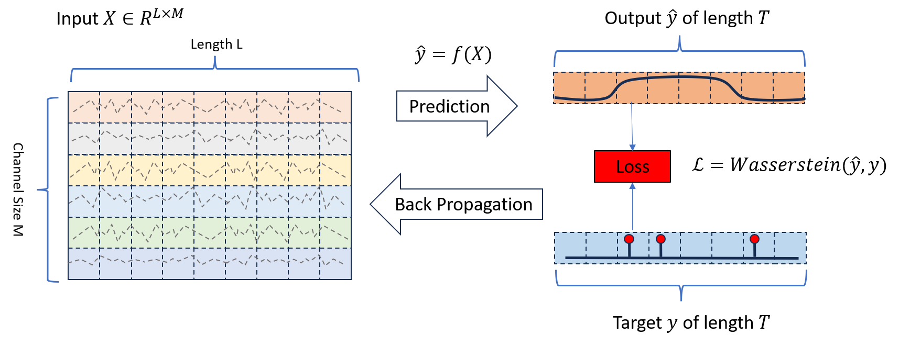
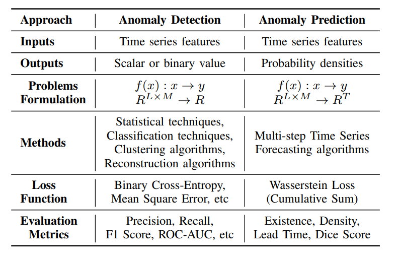
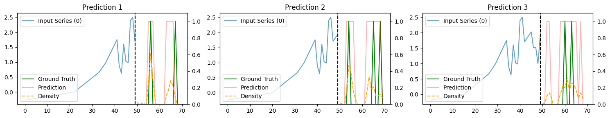
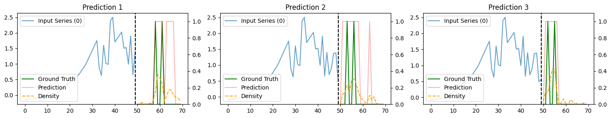
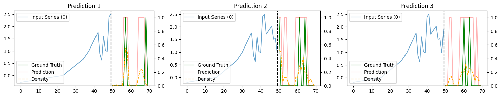
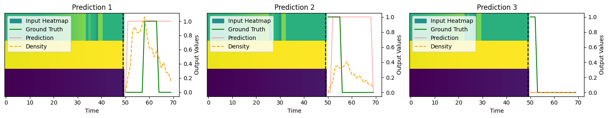
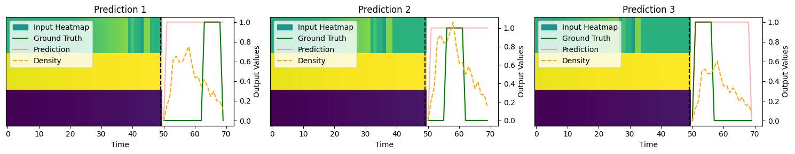

# Predicția Anomaliilor: O Nouă Abordare cu Întârziere și Orizont Explicite
Acesta este depozitul oficial pentru lucrarea „Predicția Anomaliilor: O Nouă Abordare cu Întârziere și Orizont Explicite”

Link către lucrare: https://arxiv.org/abs/2408.04377

## Rezumat
Detectarea anomaliilor în datele de tip serie temporală reprezintă o provocare critică în diverse domenii. Metodele tradiționale se concentrează de obicei pe identificarea anomaliilor în pașii imediat următori, subestimând adesea importanța dinamicii temporale, precum timpul de întârziere și orizonturile anomaliilor, care necesită în general o analiză post-eveniment amplă. Acest depozit introduce o abordare nouă pentru predicția anomaliilor în seriile temporale, încorporând informațiile temporale direct în rezultatele predicțiilor. Propunem un set de date nou, conceput special pentru a evalua această abordare, și realizăm experimente complete utilizând mai multe metode de ultimă generație. Rezultatele noastre demonstrează eficacitatea abordării noastre în furnizarea de predicții de anomalii precise și în timp util, stabilind un nou standard pentru cercetările viitoare în acest domeniu.

## Predicția Anomaliilor cu Întârziere și Orizont Explicite

*Figura 1: Ilustrarea sarcinii de Predicție a Anomaliilor.*

## Comparație între Predicția și Detectarea Anomaliilor

*Figura 2: Comparație între Predicția și Detectarea Anomaliilor.*

## Utilizare
Pentru a utiliza acest depozit, urmați pașii de mai jos:

1. Clonați depozitul:
   ```bash
   git clone https://github.com/JiangYou2025/AnomalyPrediction.git
   ```

2. Deschideți Anomaly_Prediction_Examples.ipynb:
   ```bash
   run all
   ```

## Exemple

#### Exemplu de Predicție a Anomaliilor pe Setul de Date Sintetic 1 cu Rețea Complet Conectată (FCN)



*Figura 3: Exemple 1-9 de Predicție a Anomaliilor pe Synthetical_1.*

#### Exemplu de Predicție a Anomaliilor pe Setul de Date Sintetic 10 cu Rețea Complet Conectată (FCN)



*Figura 4: Exemple 1-9 de Predicție a Anomaliilor pe Synthetical_10.*

## Citare
Când utilizați această lucrare sau codul, vă rugăm să folosiți următoarea citare:
   ```tex
   @inproceedings{you_2024_anomaly_prediction,
   author={You, Jiang and Cela, Arben and Natowicz, René and Ouanounou, Jacob and Siarry, Patrick},
   booktitle={2024 IEEE 20th International Conference on Intelligent Computer Communication and Processing (INISTA)}, 
   title={Anomaly Prediction: A Novel Approach with Explicit Delay and Horizon},
   year={2024},
   volume={},
   number={},
   pages={-},
   keywords={Time series;Anomaly Prediction;Anomaly Detection;U-Net;Transformers;},
   url={https://arxiv.org/abs/2408.04377}}
   ```
