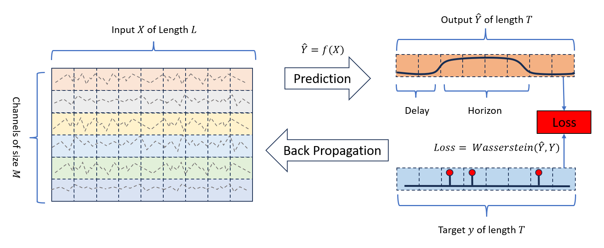
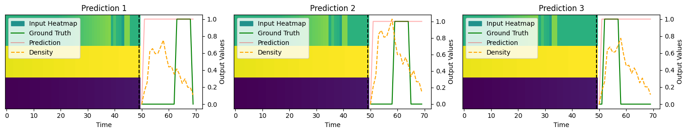

# Anomalievorhersage: Ein Neuer Ansatz mit Expliziter Verzögerung und Horizont
Dies ist das offizielle Repository für das Papier „Anomalievorhersage: Ein Neuer Ansatz mit Expliziter Verzögerung und Horizont“

[🇨🇳 简体中文](./readme_zh.md) | [🇬🇧 English](./readme.md) | [🇫🇷 Français](./readme_fr.md) | [🇩🇪 Deutsch](./readme_de.md) | [🇷🇴 Română](./readme_ro.md)

Link zum Papier: https://arxiv.org/abs/2408.04377

## Zusammenfassung
Die Erkennung von Anomalien in Zeitreihendaten stellt eine wichtige Herausforderung in verschiedenen Bereichen dar. Traditionelle Methoden konzentrieren sich typischerweise auf die Identifizierung von Anomalien in den unmittelbar folgenden Schritten und unterschätzen oft die Bedeutung zeitlicher Dynamiken wie Verzögerungszeiten und Anomaliehorizonte, die in der Regel eine umfangreiche Nachanalyse erfordern. Dieses Repository stellt einen neuen Ansatz zur Anomalievorhersage in Zeitreihen vor, der zeitliche Informationen direkt in die Vorhersageergebnisse integriert. Wir schlagen einen speziell entwickelten neuen Datensatz zur Bewertung dieses Ansatzes vor und führen umfassende Experimente mit mehreren hochmodernen Methoden durch. Unsere Ergebnisse zeigen die Wirksamkeit unseres Ansatzes für die Bereitstellung zeitnaher und präziser Anomalievorhersagen und setzen einen neuen Standard für zukünftige Forschung in diesem Bereich.

## Anomalievorhersage mit Expliziter Verzögerung und Horizont

*Abbildung 1: Darstellung der Anomalievorhersageaufgabe.*

## Vergleich von Anomalievorhersage und Anomalieerkennung

*Abbildung 2: Vergleich von Anomalievorhersage und Anomalieerkennung.*

## Nutzung
Um dieses Repository zu verwenden, folgen Sie diesen Schritten:

1. Klonen Sie das Repository:
   ```bash
   git clone https://github.com/JiangYou2025/AnomalyPrediction.git
   ```

2. Öffnen Sie Anomaly_Prediction_Examples.ipynb:
   ```bash
   run all
   ```

## Beispiele

#### Beispiel für Anomalievorhersage auf dem Synthetischen Datensatz 1 mit Vollständig Verbundenem Netzwerk (FCN)


*Abbildung 3: Beispiel 1-9 der Anomalievorhersage auf Synthetical_1.*

#### Beispiel für Anomalievorhersage auf dem Synthetischen Datensatz 10 mit Vollständig Verbundenem Netzwerk (FCN)



*Abbildung 4: Beispiel 1-9 der Anomalievorhersage auf Synthetical_10.*

## Zitation
Bei der Nutzung dieses Papiers oder Codes bitte wie folgt zitieren:
   ```tex
   @inproceedings{you_2024_anomaly_prediction,
   author={You, Jiang and Cela, Arben and Natowicz, René and Ouanounou, Jacob and Siarry, Patrick},
   booktitle={2024 IEEE 20th International Conference on Intelligent Computer Communication and Processing (ICCP)}, 
   title={Anomaly Prediction: A Novel Approach with Explicit Delay and Horizon},
   year={2024},
   volume={},
   number={},
   pages={-},
   keywords={Time series;Anomaly Prediction;Anomaly Detection;U-Net;Transformers;},
   url={https://arxiv.org/abs/2408.04377}}
   ```